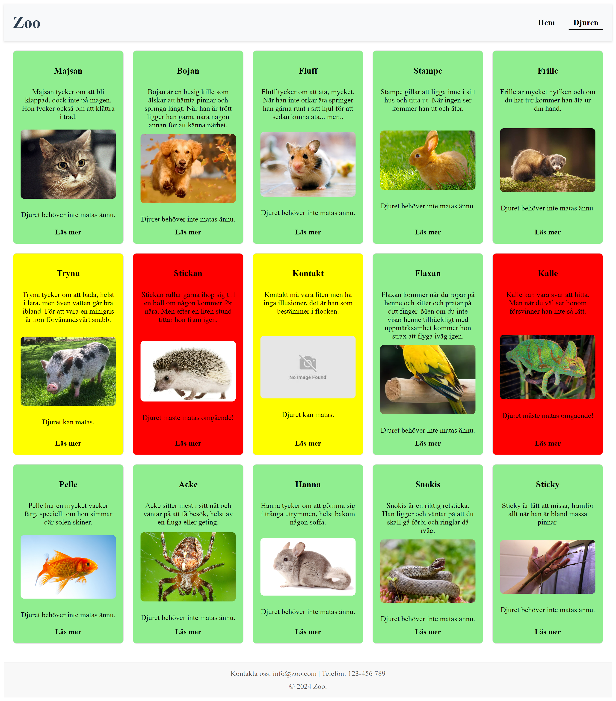

# ASSIGNMENT - The Zoo

### Course: JavaScript Advanced

## Project overview

The Zoo is a web application that allows users to explore different animals in a virtual zoo environment. It provides information about each animal, including its name, Latin name, description, year of birth, and last feeding time. Users can feed the animals and see real-time updates on their status. The application is built with React and React Router, featuring a dynamic interface that changes background colors based on feeding time.

## Start the project

npm i
npm run dev

## Tech Stack

- React
- React Router
- TypeScript
- HTML/CSS
- LocalStorage

## Screenshots

### Start Page

### Animals Page

